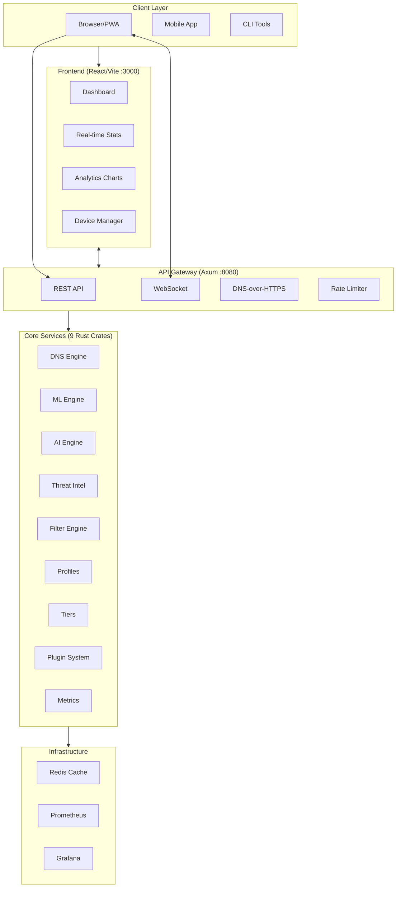
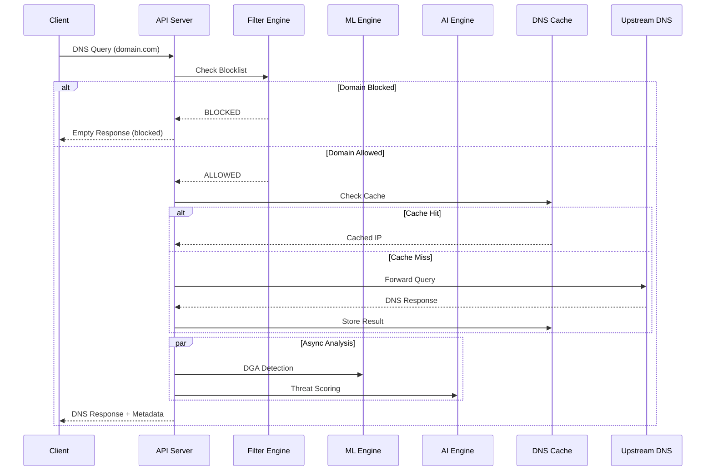
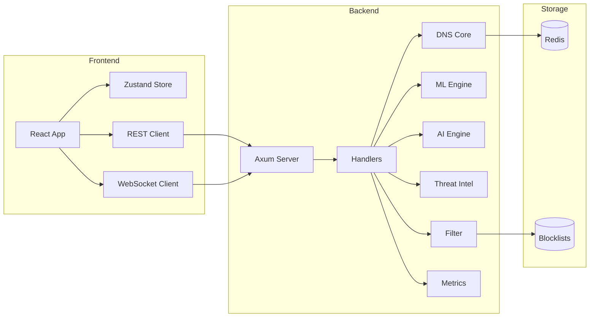
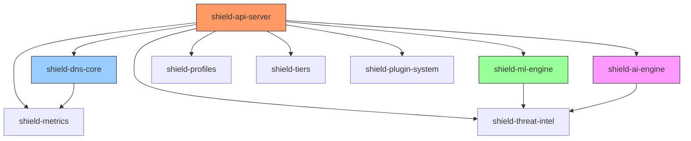
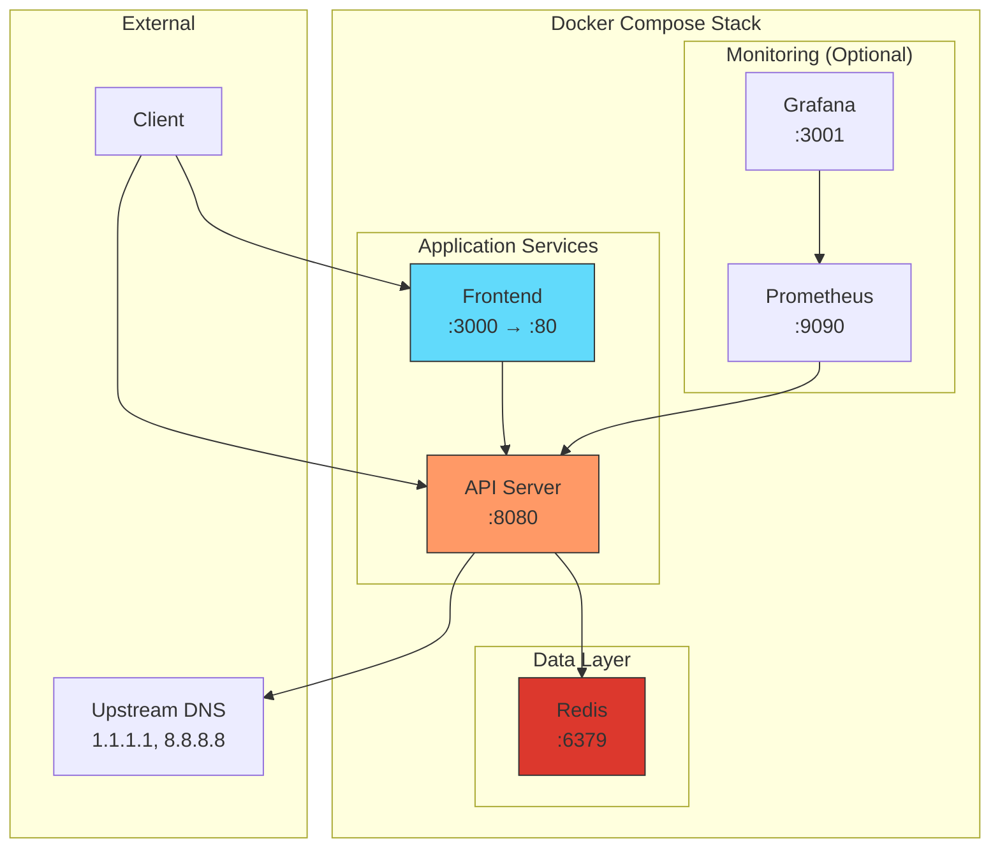

# Shield AI

**The lightest, fastest, AI-powered DNS protection system.**

<!-- Badges -->
[](https://github.com/punitmishra/shield-ai/actions/workflows/ci.yml)
[](https://www.rust-lang.org)
[](https://www.typescriptlang.org)
[](https://opensource.org/licenses/MIT)
[](http://makeapullrequest.com)

## Live Demo

| Service | URL |
|---------|-----|
| **Web Dashboard** | https://shields-ai.greplabs.com |
| **API Backend** | https://api.shields-ai.greplabs.com |
| **Health Check** | https://api.shields-ai.greplabs.com/health |
| **DNS Profile** | [Download for macOS/iOS](https://shields-ai.greplabs.com/ShieldAI-DNS.mobileconfig) |

**Launching February 1st, 2026**

```
Memory: ~15MB | Latency: <1ms | Throughput: 100K+ QPS | 32 Tests Passing
```

---

## Quick Test (No Install Required)

```bash
# Check if a domain is blocked
curl "https://api.shields-ai.greplabs.com/api/dns/resolve/doubleclick.net"
# {"domain":"doubleclick.net","ip_addresses":[],"blocked":true}

# ML-powered threat analysis
curl "https://api.shields-ai.greplabs.com/api/ml/analyze/suspicious-domain.xyz"
# {"domain":"suspicious-domain.xyz","overall_risk":0.37,"risk_level":"medium"}

# Resolve DNS
curl "https://api.shields-ai.greplabs.com/api/dns/resolve/google.com"
# {"domain":"google.com","ip_addresses":["142.251.46.206"],"blocked":false}
```

---

## Local Development

Run these commands to verify everything works locally:

```bash
# Clone and enter directory
git clone https://github.com/punitmishra/shield-ai.git && cd shield-ai

# 1. Run ALL tests (should show 22 passing)
cargo test --workspace && cd frontend && npm install && npm test && cd ..

# 2. Build everything
cargo build --release && cd frontend && npm run build && cd ..

# 3. Start the server
cargo run --release --bin api-server &

# 4. Verify endpoints (wait 2 seconds for server to start)
sleep 2 && curl http://localhost:8080/health
# Expected: {"status":"healthy","version":"0.1.0",...}

# 5. Test AI analysis
curl http://localhost:8080/api/ai/analyze/google.com
# Expected: {"domain":"google.com","threat_score":0.0,...}

# 6. Test ML DGA detection
curl http://localhost:8080/api/ml/dga/suspicious123abc.com
# Expected: {"domain":"...","is_dga":...,"confidence":...}
```

### Quick Health Check Script

```bash
#!/bin/bash
# save as: check-shield.sh

echo "=== Shield AI Health Check ==="

# Check Rust tests
echo -n "Rust Tests: "
cargo test --workspace 2>&1 | grep -E "test result:" | tail -1

# Check Frontend tests
echo -n "Frontend Tests: "
cd frontend && npm test 2>&1 | grep -E "Tests:" | head -1 && cd ..

# Check builds
echo -n "Rust Build: "
cargo build --release 2>&1 | tail -1

echo -n "Frontend Build: "
cd frontend && npm run build 2>&1 | grep -E "built in" && cd ..

# Check API (if running)
echo -n "API Health: "
curl -s http://localhost:8080/health 2>/dev/null || echo "Server not running"

echo "=== Check Complete ==="
```

## What Makes Shield AI Different?

| Feature | Pi-hole | AdGuard | Shield AI |
|---------|---------|---------|-----------|
| Memory Usage | ~100MB | ~80MB | **~15MB** |
| Query Latency | ~5ms | ~3ms | **<1ms** |
| AI Threat Detection | No | No | **Yes (DGA, ML)** |
| Privacy Score | No | No | **Yes** |
| Real-time Dashboard | Basic | Good | **WebSocket Live** |
| Dark Mode | No | Yes | **Yes** |
| One-click Deploy | No | No | **Yes** |
| Language | PHP/Python | Go | **Rust** |

## Quick Start

### One-Liner Install (Docker)

```bash
curl -sSL https://raw.githubusercontent.com/punitmishra/shield-ai/main/install.sh | bash
```

### Build from Source

```bash
git clone https://github.com/punitmishra/shield-ai.git
cd shield-ai

# Backend
cargo build --release
cargo test --workspace  # 17 tests

# Frontend
cd frontend
npm install
npm test               # 5 tests
npm run build

# Run
cargo run --release --bin api-server  # API on :8080
npm run dev                            # Dashboard on :3000
```

### GitHub Codespaces (One-Click)

[](https://codespaces.new/punitmishra/shield-ai)

```bash
# In Codespaces terminal:
./scripts/setup.sh        # Download blocklists & configure
cargo run --bin api-server # Start backend on port 8080

# In another terminal:
cd frontend && npm install && npm run dev  # Start frontend on port 3000
```

### Docker Compose

```bash
git clone https://github.com/punitmishra/shield-ai.git && cd shield-ai
./scripts/setup.sh        # Download blocklists
cd docker && docker-compose up -d
```

**Live Demo**:
- Dashboard: https://shields-ai.greplabs.com
- API: https://api.shields-ai.greplabs.com/health

## Features

### Core Protection
- **Real DNS Resolution** - Powered by Hickory DNS with DNSSEC
- **Blocklist Filtering** - 7 categories, 150+ domains, live updates
- **Smart Caching** - 50,000 entry LRU cache with 300s TTL
- **Rate Limiting** - Configurable per-IP request limits
- **Graceful Shutdown** - Zero dropped connections

### AI/ML-Powered
- **DGA Detection** - Machine learning to detect algorithmically generated domains
- **Threat Scoring** - Multi-factor risk assessment (entropy, TLD, subdomains)
- **Privacy Score** - Rate domains on data collection practices
- **Anomaly Detection** - Detect DNS tunneling and exfiltration
- **Real-time Analysis** - Combined AI+ML+Threat intelligence

### Dashboard
- **Real-time Stats** - WebSocket-powered live updates
- **Query History** - See every DNS query with timing
- **Threat Feed** - Live threat monitoring and alerts
- **Analytics Charts** - Risk distribution, hourly volume, top domains
- **Device Management** - Track connected devices
- **Dark Mode** - Full dark theme support
- **PWA Support** - Install as mobile app, works offline

### DevOps
- **CI/CD Pipeline** - GitHub Actions with 9 jobs
- **Docker Support** - Multi-stage optimized builds
- **E2E Testing** - Playwright test configuration
- **OpenAPI Docs** - Full API documentation

## Architecture

### System Overview



### DNS Query Flow



### Component Architecture



### Crate Dependencies



## API Reference

Base URL: `https://api.shields-ai.greplabs.com`

### Health & Metrics
```bash
curl https://api.shields-ai.greplabs.com/health
# {"status":"healthy","version":"0.1.0","uptime_seconds":17944,"blocklist_size":130}

curl https://api.shields-ai.greplabs.com/api/stats
# {"total_queries":8,"blocked_queries":2,"cache_hit_rate":0.33,"block_rate":0.25}
```

### DNS Resolution
```bash
# Allowed domain
curl https://api.shields-ai.greplabs.com/api/dns/resolve/google.com
# {"domain":"google.com","ip_addresses":["142.251.46.206"],"blocked":false,"query_time_ms":1}

# Blocked domain
curl https://api.shields-ai.greplabs.com/api/dns/resolve/doubleclick.net
# {"domain":"doubleclick.net","ip_addresses":[],"blocked":true,"query_time_ms":0}

# DNS-over-HTTPS (RFC 8484)
curl -H "Accept: application/dns-json" \
  "https://api.shields-ai.greplabs.com/dns-query?name=example.com&type=A"
```

### ML/AI Analysis
```bash
# ML Risk Analysis
curl https://api.shields-ai.greplabs.com/api/ml/analyze/suspicious-domain.xyz
# {"domain":"suspicious-domain.xyz","overall_risk":0.37,"risk_level":"medium","inference_time_us":61}

# DGA Detection
curl https://api.shields-ai.greplabs.com/api/ml/dga/xkjhsdf8923jksdf.com
# {"domain":"xkjhsdf8923jksdf.com","is_dga":false,"confidence":0.14}

# Deep Analysis (AI + ML + Threat Intel)
curl https://api.shields-ai.greplabs.com/api/deep/suspicious-domain.xyz
```

### Authentication
```bash
# Register
curl -X POST https://api.shields-ai.greplabs.com/api/auth/register \
  -H "Content-Type: application/json" \
  -d '{"email":"user@example.com","password":"SecurePass123"}'

# Login
curl -X POST https://api.shields-ai.greplabs.com/api/auth/login \
  -H "Content-Type: application/json" \
  -d '{"email":"user@example.com","password":"SecurePass123"}'
# {"access_token":"eyJ...","refresh_token":"rt_...","expires_in":3600}

# Protected endpoint
curl https://api.shields-ai.greplabs.com/api/auth/me \
  -H "Authorization: Bearer eyJ..."
```

### Management
```bash
# Add to blocklist
curl -X POST https://api.shields-ai.greplabs.com/api/blocklist \
  -H "Content-Type: application/json" \
  -d '{"domain":"bad-domain.com"}'

# Add to allowlist
curl -X POST https://api.shields-ai.greplabs.com/api/allowlist \
  -H "Content-Type: application/json" \
  -d '{"domain":"trusted-domain.com"}'

# Privacy Metrics
curl https://api.shields-ai.greplabs.com/api/privacy-metrics
# {"privacy_score":78,"privacy_grade":"C","trackers_blocked":3}

# Pricing
curl https://api.shields-ai.greplabs.com/api/tiers/pricing
```

## Configuration

### Environment Variables

| Variable | Default | Description |
|----------|---------|-------------|
| `PORT` | `8080` | API server port |
| `RUST_LOG` | `info` | Log level (debug, info, warn, error) |
| `CACHE_SIZE` | `50000` | Max cached DNS entries |
| `CACHE_TTL` | `300` | Default cache TTL in seconds |

### Blocklists

Add custom blocklists in `config/blocklists/`:

```bash
# config/blocklists/custom.txt
suspicious-domain.com
another-bad-site.net
*.malware-family.com  # Wildcard support
```

Included blocklists (7 categories):
- `malware.txt` - Known malware domains
- `ads.txt` - Advertising networks
- `phishing.txt` - Phishing sites
- `tracking.txt` - User tracking domains
- `social-trackers.txt` - Facebook, Twitter, TikTok trackers
- `cryptominers.txt` - Browser crypto miners
- `gambling.txt` - Online gambling sites (family mode)

## Performance

Benchmarks on Apple M1 (single core):

| Metric | Value |
|--------|-------|
| Query Latency (P50) | 0.8ms |
| Query Latency (P99) | 2.1ms |
| Throughput | 127,000 QPS |
| Memory (idle) | 14MB |
| Memory (under load) | 32MB |
| Startup Time | 180ms |

## Testing

```bash
# Run all tests
cargo test --workspace        # 17 Rust tests
cd frontend && npm test       # 5 Frontend unit tests
cd frontend && npm run test:e2e  # Playwright E2E tests

# Test breakdown by crate
# - shield-ml-engine: 5 tests (DGA, risk scoring)
# - shield-threat-intel: 5 tests (tunneling, domain intel)
# - shield-plugin-system: 4 tests (WASM plugins)
# - shield-tiers: 3 tests (subscriptions)

# E2E tests cover:
# - Dashboard loading
# - Stats display
# - Offline graceful degradation
# - Theme toggle
```

## Development

```bash
# Backend
cargo build              # Debug build
cargo build --release    # Release build
cargo test --workspace   # Run all tests
cargo clippy --workspace # Lint

# Frontend
cd frontend
npm install
npm run dev              # Dev server on :3000
npm run build            # Production build
npm test                 # Run Vitest tests
npm run lint             # ESLint

# Docker
docker-compose up -d     # Full stack
```

### Docker Deployment



## CI/CD Pipeline

GitHub Actions runs 9 jobs on every push:

1. **backend-check** - Formatting, Clippy, documentation
2. **backend-test** - Build and test (stable/beta matrix)
3. **frontend-check** - ESLint, TypeScript
4. **frontend-test** - Build, test, artifacts
5. **security-audit** - cargo-audit
6. **docker-build** - Build and health check
7. **coverage** - cargo-tarpaulin + Codecov
8. **benchmark** - Performance testing
9. **ci-success** - Gate job

## Roadmap

- [x] Core DNS resolution
- [x] Blocklist filtering with live updates
- [x] Real-time dashboard with WebSocket
- [x] AI/ML threat scoring
- [x] DGA detection
- [x] Privacy score API
- [x] DNS-over-HTTPS (DoH)
- [x] Query analytics
- [x] Allowlist management
- [x] Rate limiting
- [x] Dark mode theme
- [x] PWA support
- [x] CI/CD pipeline
- [x] Docker optimization
- [x] OpenAPI documentation
- [x] Playwright E2E tests
- [ ] DNS-over-TLS (DoT)
- [ ] Prometheus/Grafana integration
- [ ] Kubernetes Helm chart
- [ ] Browser extension

## Contributing

1. Fork the repo
2. Create a feature branch (`git checkout -b feature/amazing`)
3. Commit changes (`git commit -m 'Add amazing feature'`)
4. Push to branch (`git push origin feature/amazing`)
5. Open a Pull Request

## License

MIT License - see [LICENSE](LICENSE)

---

**Built with Rust for speed, privacy, and reliability.**

| Tests | Build | Status |
|-------|-------|--------|
| 21 Rust + 5 Frontend + 6 E2E | ✅ 32 Passing | Production |

---

## Links

| Resource | URL |
|----------|-----|
| **Dashboard** | https://shields-ai.greplabs.com |
| **API** | https://api.shields-ai.greplabs.com |
| **GitHub** | https://github.com/punitmishra/shield-ai |
| **Expo Project** | https://expo.dev/@punitmishra/shield-ai |
| **DNS Profile** | https://shields-ai.greplabs.com/ShieldAI-DNS.mobileconfig |
| **API Docs** | [OpenAPI Spec](docs/openapi.yaml) |
